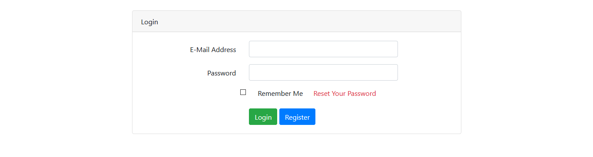
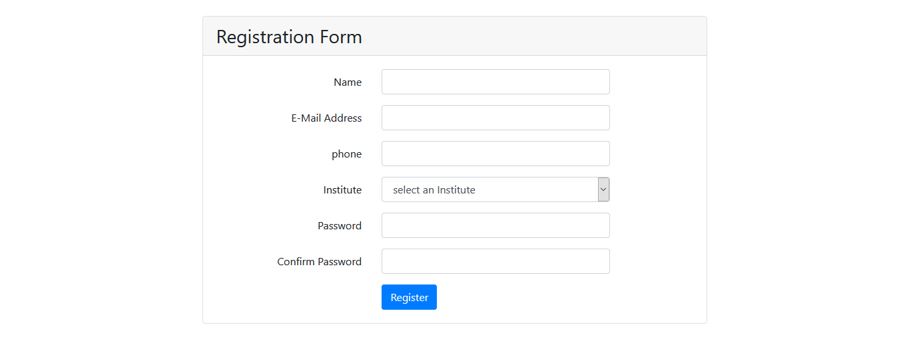
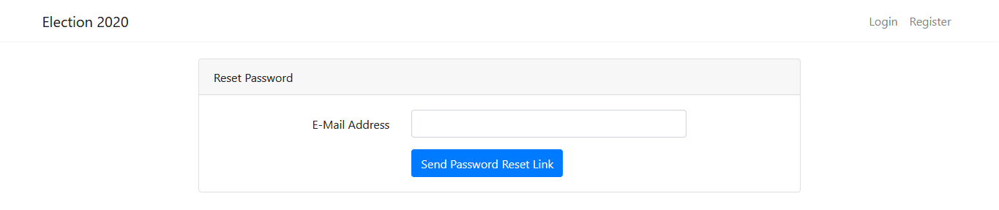
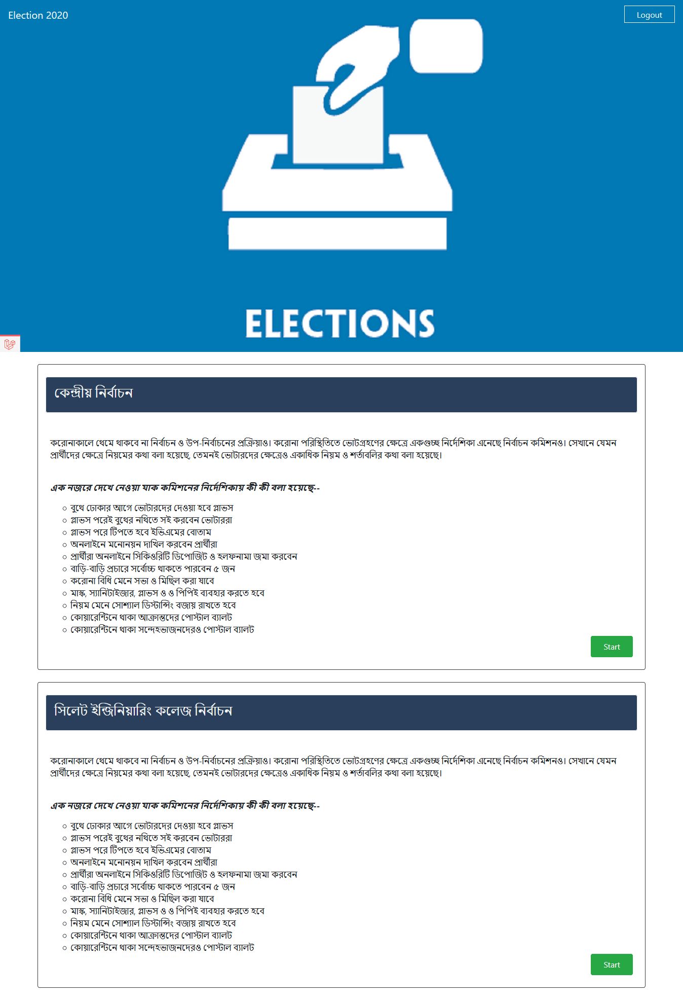

# Election 2020
### Voter instruction 
1. ## Login, Register  and Password Reset 
    - For Login go to [Election 2020](http://election2020.abasas.tech/login) 
    - For Register goto [Registration Page](http://election2020.abasas.tech/register)  
    - For Reset Password  goto [Reset password Page](https://election2020.abasas.tech/password/reset)  

1. ## Active Account  
    - After Registration your account need to active. to active you need to contact your campus Admin 

1. ## Vote
    - go to [Vote 2020](http://election2020.abasas.tech/)
    - click on  Start 
1. Click on Vote Button to vote 

    
